# TriggerStocks

TriggerStocks is a web application designed to simplify the process of staying informed about significant events affecting the stock market. Tailored for users who are passionate about investing and staying updated on market dynamics, this platform streamlines the task of monitoring stock triggers while saving valuable time and effort.

The live link can be found here - [TriggerStocks](https://stocktriggers-dffa3b7c370b.herokuapp.com/)

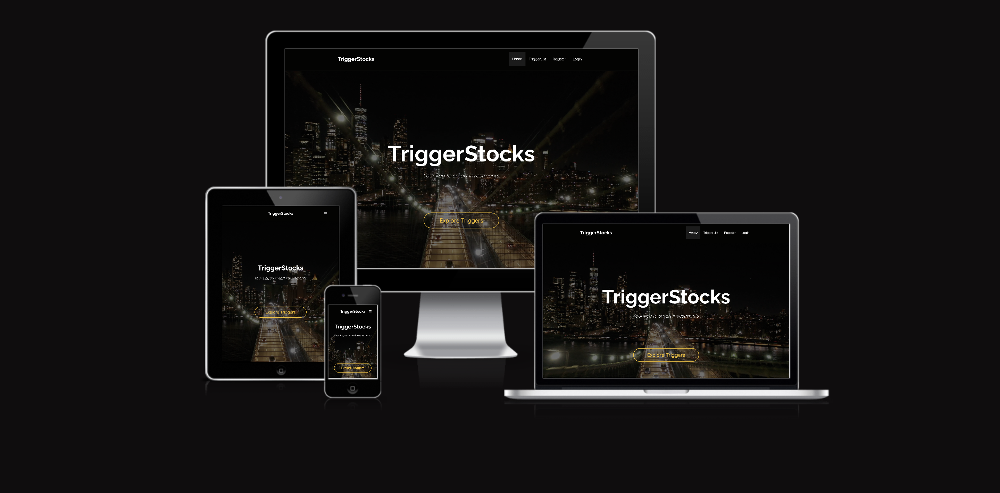

## Site Owner Goals

- To provide users with the best stock trigger tips and to easily navigate through them.
- To provide users with easy access to additional information and to facilitate seamless access to trading sites.
- To offer users a comment section where they can share their thoughts about the triggers.
- User-friendly design to provide users with an easy way to follow the triggers conveniently.

## User Stories

- ### First-time User
  - As a first-time user, I want to understand the main purpose of the site and learn about the benefits of staying informed about stock triggers.
  - As a first-time user, I want to navigate the website intuitively, ensuring a positive and enjoyable experience.
  - As a first-time user, I want to be able to browse stock triggers without having to sign up or register.

- ### Returning User
  - As a returning user, I want to effortlessly navigate to the latest stock triggers, ensuring I stay updated on market events.
  - As a returning user, I want to find comprehensive information about each trigger, including company details and related press releases, to make informed decisions.
  - As a returning user, I want to easily access the comment section to share my thoughts and insights about specific triggers.

- ### Frequent User
  - As a frequent user, I want to quickly bookmark my favorite triggers for easy access later, ensuring I can track them effectively.
  - As a frequent user, I want to explore additional resources such as educational content and trading platform links, enhancing my understanding and trading experience.
  - As a frequent user, I want to receive personalized notifications about important trigger updates, ensuring I never miss critical market events.

## Design

### Video
The captivating video at the top of the Stock Trigger website features a bustling cityscape with skyscrapers and a majestic bridge. This dynamic imagery sets the tone for the site, evoking energy and excitement while mirroring the fast-paced nature of the stock market.

### Image
In the "Suggest" section, users encounter an impactful image of a bull, symbolizing strength and bullish market sentiment. This visual reinforces the website's focus on identifying opportunities for success in the stock market.

### Colors
The color palette of the Stock Trigger site is carefully chosen to evoke a sense of professionalism, trustworthiness, and clarity. Utilizing a combination of deep blues, sleek grays, and vibrant accents, the site's colors exude a sense of reliability and sophistication. The primary color scheme consists of shades of navy blue and charcoal gray, complemented by pops of vibrant yellow to draw attention to key elements and calls to action.

### Fonts
The Stock Trigger website uses **Quicksand** as its primary font, lending a modern and professional feel to the content. **Raleway** is reserved for headers and larger text, adding emphasis and style to key sections. These fonts work together to create a visually appealing and easily readable experience for users, enhancing the overall design and usability of the site. This font was imported via [Google Fonts](https://fonts.google.com/)

### Wireframes

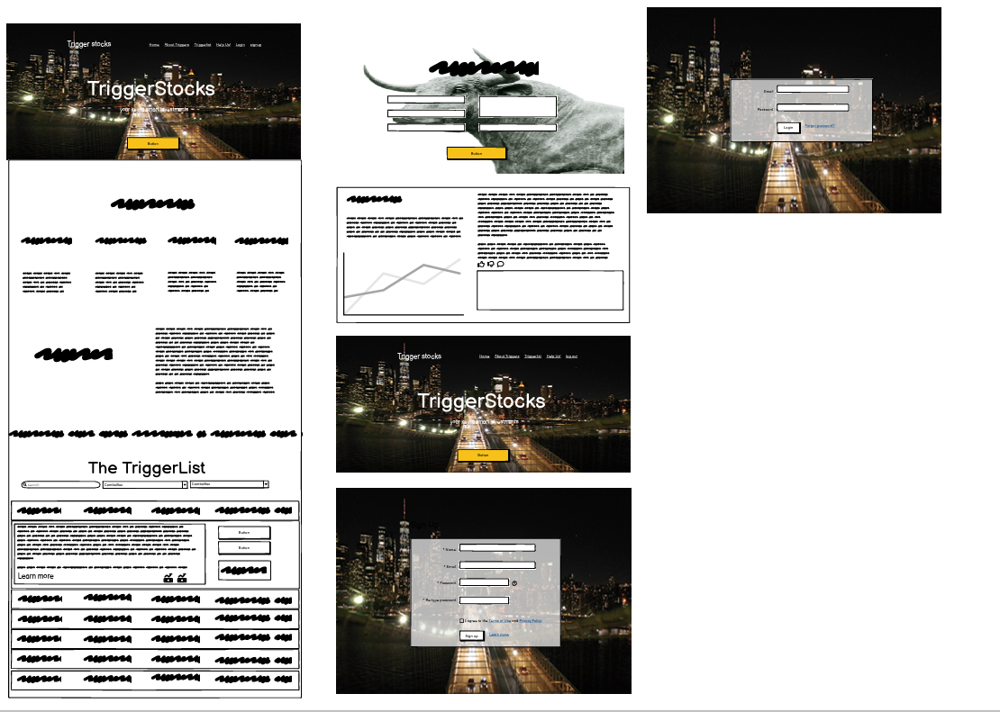

## Agile Methodology

Github projects was used to manage the development process using an agile approach. Please see link to project board [here](add link here)

## Data Model

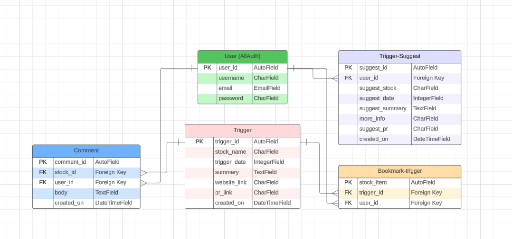

### User Authentication

- Django's LoginRequiredMixin is used to make sure that any requests to access secure pages by non-authenticated users are redirected to the login page. 

### Form Validation
If incorrect or empty data is added to a form, the form won't submit and a warning will appear to the user informing them what field raised the error. 

### Database Security
The database url and secret key are stored in the env.py file to prevent unwanted connections to the database and this was set up before the first push to Github.

Cross-Site Request Forgery (CSRF) tokens were used on all forms throughout this site.

## Features

### Header

**Logo**
- It features a white logo elegantly crafted with the Raleway font.
- This logo is positioned in the top left of the navigation bar. The logo is linked to the home page for ease of navigation for the user.

**Navigation Bar**

- The navigation bar is present at the top of every page and includes all links to the various other pages.
- "When users log in, they'll see the 'Favorites' link and the 'Suggest' button."
- The options to Sign up or Log in will change to the option to log out once a user has logged in.
- The navigation bar is fully responsive, collapsing into a hamburger menu when the screen size becomes too small.
- Hovering over the links will make the links yellow.
- The navbar is sticky so it will be on the top of the page when you scroll.

### Footer 

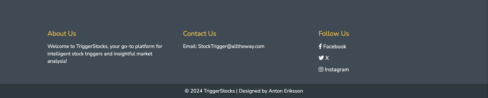

- The footer section includes links to Facebook, Instagram and X. It also includes a 'contact us' and a short explination about the site
- Clicking the links in the footer opens a separate browser tab to avoid pulling the user away from the site.

### Home Page

**Call to Action Section**

- The home page features a captivating video showcasing dynamic stock market scenes, setting the stage for an engaging exploration of TriggerStocks.
- Upon arrival, users are greeted with the bold message "TriggerStocks: Your key to smart investments" overlaid on the video background, emphasizing the site's mission to provide valuable investment insights.
- A compelling call-to-action encourages users to dive into the world of triggers by exploring the Trigger List, guiding them towards informed investment decisions.
- With a seamless experience, users are invited to embark on their investment journey with TriggerStocks, where smart investments are just a click away.

**What Is A Trigger**

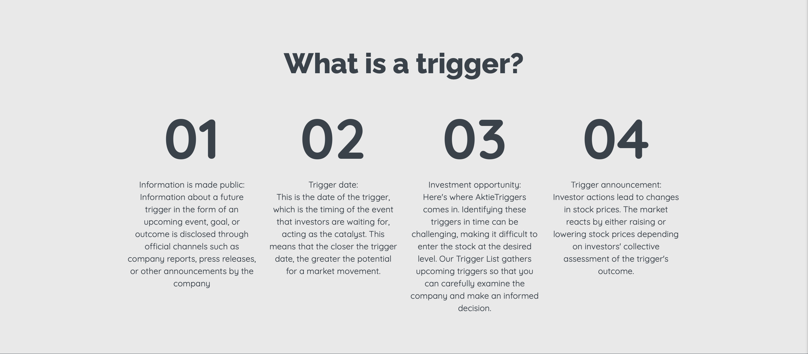

- The "What is a trigger?" section offers a comprehensive explanation of the concept, breaking it down into four key components.
- Firstly, triggers involve the disclosure of information through official channels, such as company reports or press releases, providing insights into future events or outcomes.
- Each trigger is associated with a trigger date, indicating the timing of the event and its potential impact on the market.
- Identifying triggers presents investment opportunities, allowing investors to analyze companies and make informed decisions.
- Finally, investor actions in response to triggers influence stock prices, reflecting market sentiments and expectations.

**Our Purpose**

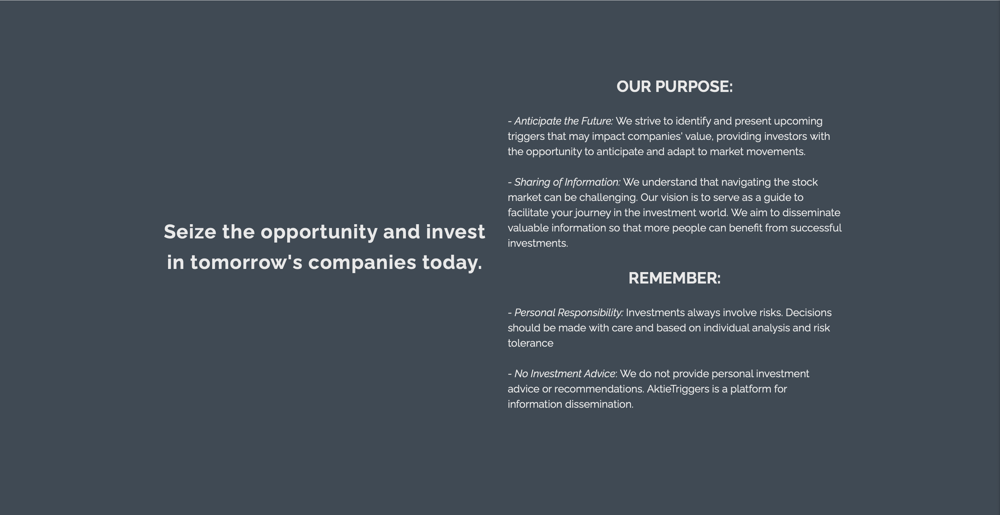

This section on the TriggerStocks website articulates our mission and goals. It's aimed at providing investors with insights and information to make informed decisions in the stock market. The objectives are:

- Seize the opportunity and invest in tomorrow's companies today: Identifying upcoming triggers to anticipate market movements.
- Sharing of Information: Guiding investors with valuable insights for successful investments.
- Remember: Emphasizing personal responsibility in decisions; TriggerStocks does not offer investment advice.

**TriggerList**

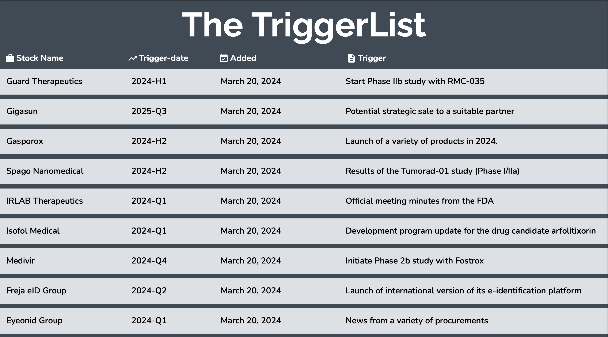

The TriggerList page displays all triggers, with the most recent triggers at the top.

- Users can find detailed information about each trigger, including:
  - Stock Name
  - Trigger Date
  - Added Date (hidden on small screens)
  - Trigger Description

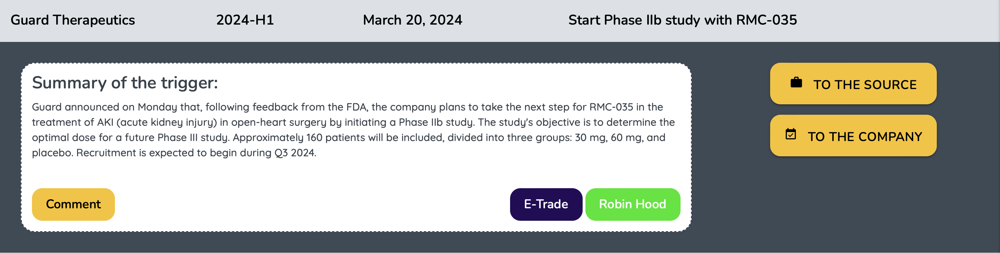

- Triggers are presented in a list format, allowing users to easily browse through them.
- Each trigger item includes a drop down that contains a summary of the trigger and options to:
  - Comment on the trigger
  - Access additional resources for trading (e.g., E-Trade, Robin Hood)
- Links are provided to the source of the trigger information and the company's website for further details.

### User Account Pages

**Sign Up**

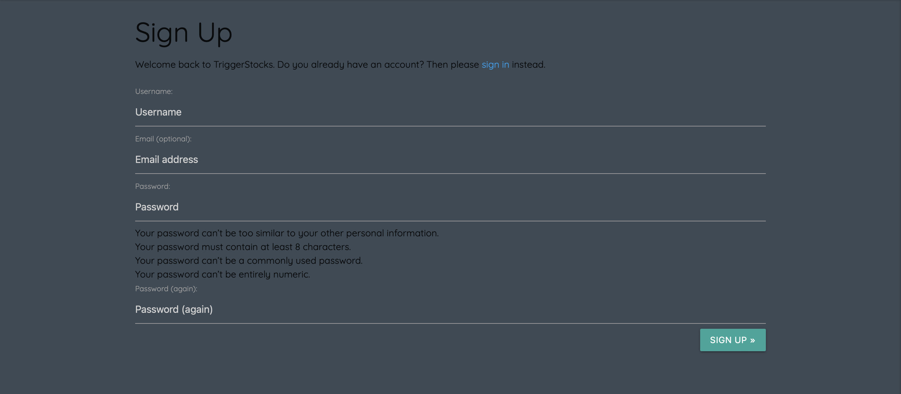

**Log In**

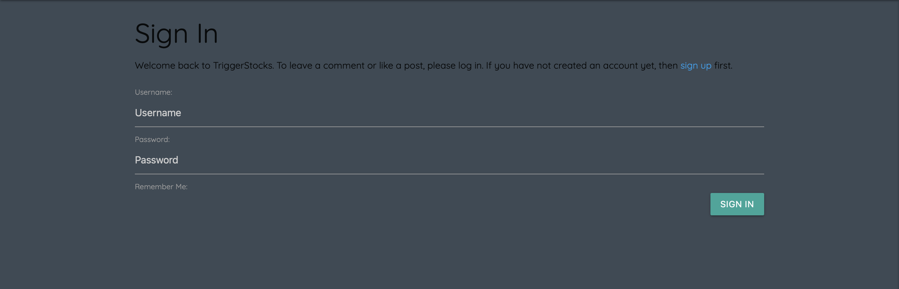

**Log Out**

- Django allauth was installed and used to create the Sign up, Log in and Log out functionality. 
- Success messages inform the user if they have logged in/ logged out successfully.

### The Trigger Details

**Header And Summary**

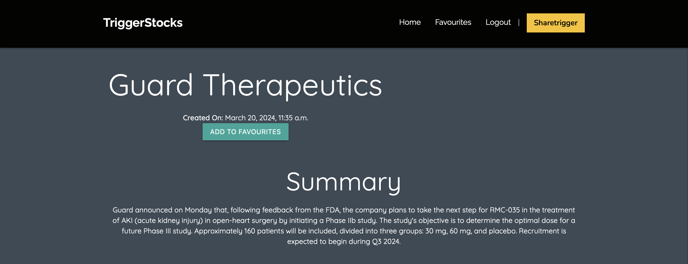

The Trigger Detail page provides comprehensive information about a specific trigger.

- Users can view details such as the stock name and the date the trigger was created.
- An option to add the trigger to favorites is available, allowing users to keep track of important triggers.
- The trigger summary section provides a brief overview of the trigger, allowing users to quickly understand its significance.

**comment section** 

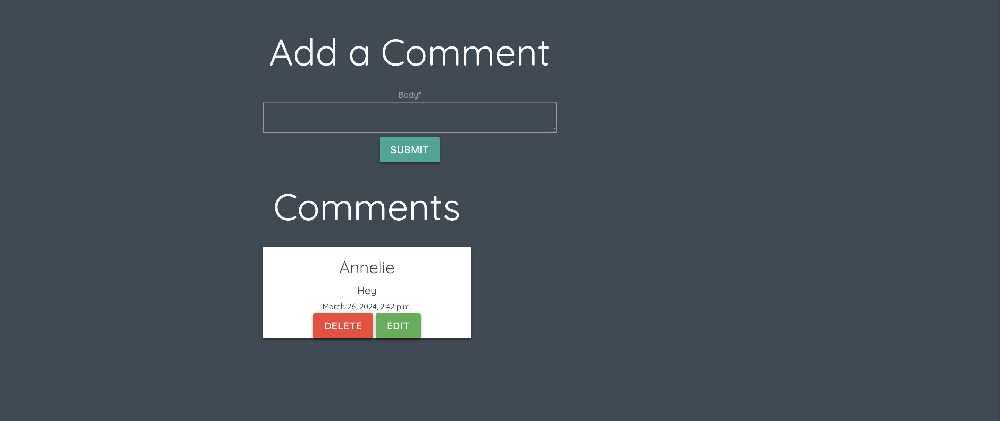

The Comment Section allows users to interact by adding comments and viewing existing ones.

- Users can add comments using the provided form, with fields for the author's name and comment body.
- Existing comments are displayed below the comment form, showing the author's name, comment text, and creation date.
- Authenticated users have options to edit or delete their own comments using corresponding buttons.
- A modal confirmation window is provided for deleting comments, ensuring user confirmation before deletion.

### Favourite Trigger Page

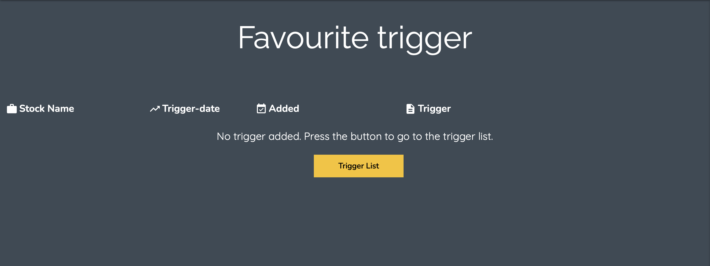

The Favourite Trigger Page displays a list of user-selected favourite triggers.

- The page header prominently displays "Favourite trigger."
- Trigger information is organized into columns, including stock name, trigger date, added date, and trigger description.
- Each trigger is collapsible, showing additional details upon expansion.
- Users can remove triggers from their favourites list using the provided "Remove" button.
- For each trigger, a summary of the trigger is provided along with buttons to view comments, access the source, and visit the company's website.
- If no triggers have been added as favourites, a message encourages users to visit the Trigger List page.

This summary outlines the key features and functionality of the Favourite Trigger Page, providing users with easy access to their preferred triggers.

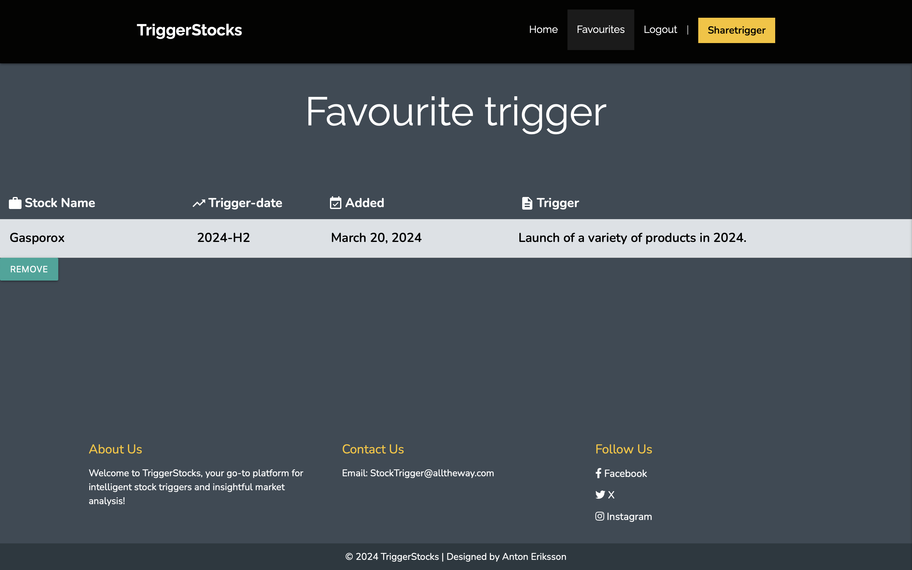

### Share Trigger Page

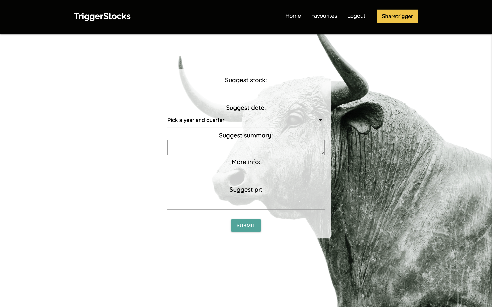
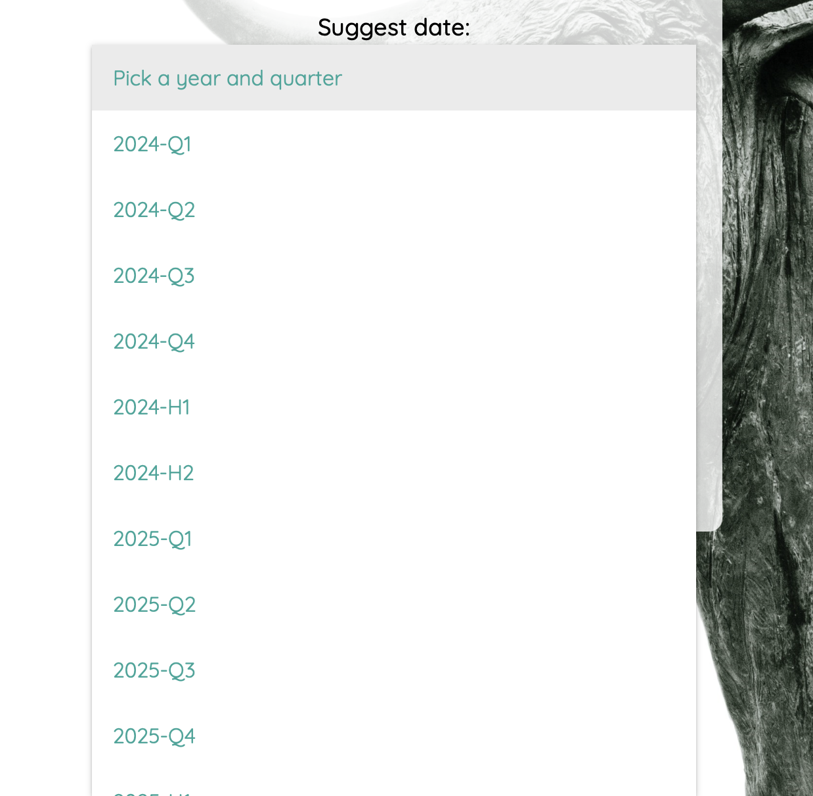

The Share Trigger Page allows users to submit new triggers to the platform.

- The page features a form where users can input trigger information.
- The form includes fields for the stock name, trigger date, trigger headline, and trigger summary.
- Upon completing the form, users can submit the trigger information by clicking the "Submit" button.

The Share Trigger Page provides users with a convenient way to contribute new triggers to the platform, enhancing the community's access to valuable information.

Additionally, the page features a background image of a bull, adding visual interest and reinforcing the financial theme of the platform.

### Future Features

In the future, I aim to implement the following features to enhance the platform:

- **Stock Price Display**: Integrate stock price information for each listed stock, providing users with real-time data to inform their decisions.

- **Graphical Analysis Tools**: Incorporate graphical representations, such as graphs and charts, to visualize stock performance and trends, aiding users in making informed investment decisions.

- **Interactive Forum**: Establish a forum where users can engage in discussions, share insights, and exchange information about stocks, fostering a community-driven approach to investing.

- **Automated Trigger Search**: Develop functionality that autonomously searches for triggers based on predefined criteria, streamlining the process of identifying potential investment opportunities.

These additions aim to enrich the user experience, empowering investors with valuable tools and resources to navigate the stock market effectively.

## Deployment - Heroku

To deploy this page to Heroku from its GitHub repository, the following steps were taken:

### Create the Heroku App:
- Log in to [Heroku](https://dashboard.heroku.com/apps) or create an account.
- On the main page click the button labelled New in the top right corner and from the drop-down menu select "Create New App".
- Enter a unique and meaningful app name.
- Next select your region.
- Click on the Create App button.

### Attach the Postgres database:
- In the Resources tab, under add-ons, type in Postgres and select the Heroku Postgres option.
- Copy the DATABASE_URL located in Config Vars in the Settings Tab.

### Prepare the environment and settings.py file:
- In your GitPod workspace, create an env.py file in the main directory.
- Add the DATABASE_URL value and your chosen SECRET_KEY value to the env.py file. 
- Update the settings.py file to import the env.py file and add the SECRETKEY and DATABASE_URL file paths.
- Comment out the default database configuration.
- Save files and make migrations.
- Add Cloudinary URL to env.py
- Add the cloudinary libraries to the list of installed apps.
- Add the STATIC files settings - the url, storage path, directory path, root path, media url and default file storage path.
- Link the file to the templates directory in Heroku.
- Change the templates directory to TEMPLATES_DIR
- Add Heroku to the ALLOWED_HOSTS list the format ['app_name.heroku.com', 'localhost']

### Create files / directories
- Create requirements.txt file
- Create three directories in the main directory; media, storage and templates.
- Create a file named "Procfile" in the main directory and add the following: web: gunicorn project-name.wsgi

### Update Heroku Config Vars
Add the following Config Vars in Heroku:
- SECRET_KEY value 
- CLOUDINARY_URL

### Deploy
- NB: Ensure in Django settings, DEBUG is False
- Go to the deploy tab on Heroku and connect to GitHub, then to the required repository. 
- Scroll to the bottom of the deploy page and either click Enable Automatic Deploys for automatic deploys or Deploy Branch to deploy manually. Manually deployed branches will need re-deploying each time the repo is updated.
- Click View to view the deployed site.

The site is now live and operational.
## Forking this repository
- Locate the repository at this link [TriggerStocks](https://github.com/AntonEi/TriggerStocks).
- At the top of the repository, on the right side of the page, select "Fork" from the buttons available. 
- A copy of the repository is now created.

## Cloning this repository
To clone this repository follow the below steps: 

1. Locate the repository at this link [TriggerStocks](https://github.com/AntonEi/TriggerStocks). 
2. Under **'Code'**, see the different cloning options, HTTPS, SSH, and GitHub CLI. Click the prefered cloning option, and then copy the link provided. 
3. Open **Terminal**.
4. In Terminal, change the current working directory to the desired location of the cloned directory.
5. Type **'git clone'**, and then paste the URL copied from GitHub earlier. 
6. Type **'Enter'** to create the local clone. 

## Languages

- Python
- HTML
- CSS
- Javascript

## Frameworks - Libraries - Programs Used
- [Django](https://www.djangoproject.com/): Main python framework used in the development of this project
- [Django-allauth](https://django-allauth.readthedocs.io/en/latest/installation.html): authentication library used to create the user accounts
- [PostgreSQL](https://www.postgresql.org/) was used as the database for this project.
- [Heroku](https://dashboard.heroku.com/login) - was used as the cloud based platform to deploy the site on.
- [Responsinator](http://www.responsinator.com/) - Used to verify responsiveness of website on different devices.
- [Balsamiq](https://balsamiq.com/) - Used to generate Wireframe images.
- [Chrome Dev Tools](https://developer.chrome.com/docs/devtools/) - Used for overall development and tweaking, including testing responsiveness and performance.
- [Font Awesome](https://fontawesome.com/) - Used for icons in information bar.
- [GitHub](https://github.com/) - Used for version control and agile tool.
- [Google Fonts](https://fonts.google.com/) - Used to import and alter fonts on the page.
- [W3C](https://www.w3.org/) - Used for HTML & CSS Validation.
- [PEP8 Online](http://pep8online.com/) - used to validate all the Python code
- [Jshint](https://jshint.com/) - used to validate javascript
- [Coolors](https://coolors.co/) - Used to create colour palette.
- [Favicon](https://favicon.io/) - Used to create the favicon.
- [Lucidchart](https://lucid.app/documents#/dashboard) - used to create the database schema design
- [Summernote](https://summernote.org/): A WYSIWYG editor to allow users to edit their posts
- [Crispy Forms](https://django-crispy-forms.readthedocs.io/en/latest/) used to manage Django Forms materialize
- [Materialize](https://materializecss.com): CSS Framework for developing responsiveness and styling

## Credits
    
- [Stack Overflow](https://stackoverflow.com/)
- [Materialize](https://materializecss.com)
- [Pexels](https://www.pexels.com/): All imagery on the site was sourced from Pexels.com
- [Code Institute - Blog Walkthrough Project](https://github.com/Code-Institute-Solutions/Django3blog)

## Acknowledgments

Many thanks to my mentor Antonio for his support and advice. Thanks to The Code Institute tutoring for helping me out.

Also, many thanks to my fellow student Elin Dalenbäck.
