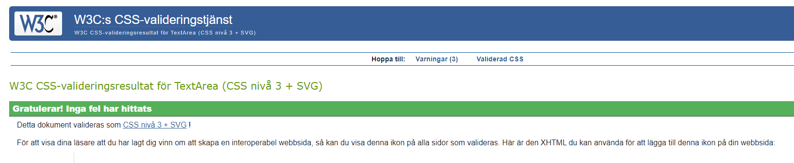
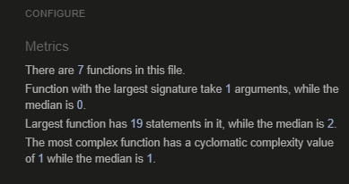

### HTML

All HTML pages were run through the [W3C HTML Validator](https://validator.w3.org/). See results in below table.
| Page                 | Logged Out | Logged In |
|----------------------|------------|-----------|
| Trigger_detail.html  | No errors  | No errors |
| base.html            | No errors  | No errors |
| sharetriggers.html   | N/A        | No errors |
| index.html           | No errors  | No errors |
| favorites.html       | N/A        | No errors |
| login.html           | No errors  | N/A       |
| logout.html          | N/A        | No errors |
| signup.html          | No errors  | N/A       |

#### Fixed Errors 
Had a problem with dubble id. I had to move the id to a div. 

### CSS
No errors were found when passing my CSS file through the official [W3C CSS Validator](https://jigsaw.w3.org/css-validator/)

 

 
CSS

 

### Javascript
No errors were found when passing my javascript through [Jshint](https://jshint.com/) 

Jshint

### Python
All Python files were run through [Pep8](https://pep8ci.herokuapp.com/#) with no errors found. 

## Browser Testing
- The Website was tested on Google Chrome, Firefox, Safari browsers with no issues noted.

## Device Testing
- The website was viewed on a variety of devices such as Desktop, Laptop, iPhone 8, iPhoneXR and iPad to ensure responsiveness on various screen sizes in both portrait and landscape mode. The website performed as intended. The responsive design was also checked using Chrome developer tools across multiple devices with structural integrity holding for the various sizes.

## Manual Testing

### Site Navigation
| Element               | Action     | Expected Result                                                    | Pass/Fail |
|-----------------------|------------|--------------------------------------------------------------------|-----------|
| NavBar                |            |                                                                    |           |
| Site Name (logo area) | Click      | Redirect to home                                                   | Pass      |
| Home Link             | Click      | Redirect to home                                                   | Pass      |
| Triggerlist           | Click      | Scolls down to trigger section                                     | Pass      |
| Favourites            | Click      | Opens the favouites page                                           | Pass      |
| Favourites            | Display    | Only visible if user in session                                    | Pass      |
| Logout Link           | Click      | Open logout confirm page                                           | Pass      |
| Logout Link           | Display    | Only visible if user in session                                    | Pass      |
| Sharetrigger          | Click      | Opens the shretigger page                                          | Pass      |
| Sharetrigger          | Display    | Only visible if user in session                                    | Pass      |
| Sign Up Link          | Click      | Open Sign up page                                                  | Pass      |
| Sign Up Link          | Display    | Not visible if user in session                                     | Pass      |
| Log In Link           | Click      | Open Login page                                                    | Pass      |
| Log In Link           | Display    | Not visible if user in session                                     | Pass      |
| All Nav Links         | Hover      | Makes links yellow                                                 | Pass      |
|                       |            |                                                                    |           |
| Mobile View           |            |                                                                    |           |
| Hamburger Menu        | Responsive | Display when screen size reduces to medium size                    | Pass      |
| Site Name (logo area) | Click      | Redirect to home                                                   | Pass      |
| Home Link             | Click      | Redirect to home                                                   | Pass      |
| Triggerlist           | Click      | Scolls down to trigger section                                     | Pass      |
| Favourites            | Click      | Opens the favouites page                                           | Pass      |
| Favourites            | Display    | Only visible if user in session                                    | Pass      |
| Logout Link           | Click      | Open logout confirm page                                           | Pass      |
| Logout Link           | Display    | Only visible if user in session                                    | Pass      |
| Sharetrigger          | Click      | Opens the shretigger page                                          | Pass      |
| Sharetrigger          | Display    | Only visible if user in session                                    | Pass      |
| Sign Up Link          | Click      | Open Sign up page                                                  | Pass      |
| Sign Up Link          | Display    | Not visible if user in session                                     | Pass      |
| Log In Link           | Click      | Open Login page                                                    | Pass      |
| Log In Link           | Display    | Not visible if user in session                                     | Pass      |
|                       |            |                                                                    |           |
| Footer                |            |                                                                    |           |
| All links             | Click      | Open in new tab and to correct location                            | Pass      |

### Home Page
| Element               | Action  | Expected Result                 | Pass/Fail |
|-----------------------|---------|---------------------------------|-----------|
| Explore trigger Button| Click   | Scolls down to trigger section  | Pass      |

### Triggerlist
| Element              | Action            | Expected Result                                                                         | Pass/Fail |
|----------------------|-------------------|-----------------------------------------------------------------------------------------|-----------|
| Trigger Content      | Display           | Displays the correct trigger, triggerdate, added and trigger headline                   | Pass      |
| Collapsible-header   | Click             | Infogrid opens up                                                                       | Pass      |
| Comment button       | Click             | Opens the trigger_detail.html page                                                      | Pass      |
| E-trading button     | Click             | Opens the webiste for E-Trade                                                           | Pass      |
| Robin Hood button    | Click             | Opens the webiste for Robin Hood                                                        | Pass      |
| To The Source button | Click             | Opens the webiste to the source                                                         | Pass      |
| To The Company button| Click             | Opens the webiste to the company                                                        | Pass      |

### Trigger Detail Page

| Element                        | Action              | ExpectedResult                                                               | Pass/Fail |
|--------------------------------|---------------------|------------------------------------------------------------------------------|-----------|
| Trigger Content                | Display             | Displays the correct trigger, triggerdate, added and summary                 | Pass      |
| Add to favourites              | Click               | Adds the trigger to the favourites list                                      | Pass      |
| Add to favourites              | Click               | Form only visible if user is login                                           | Pass      |
| User Comments                  | Display             | Displays correct name date time and comment body                             | Pass      |
| User Comments                  | Display             | Comments are ordered oldest to newest                                        | Pass      |
| Update comment button          | Display             | Button only visible if user is the comment author                            | Pass      |
| Update comment button          | Click               | Opens Update Comment Form                                                    | Pass      |
| Update comment form            | Leave empty         | On submit: form won't submit                                                 | Pass      |
| Delete comment button          | Display             | Button only visible if user is the comment author                            | Pass      |
| Delete comment button          | Click               | Opens delete comment confirmation page                                       | Pass      |
| Confirm delete button          | Click               | Comment is removed from comment section                                      | Pass      |  
| Confirm delete button          | Click               | Success message appears informing the user that the comment has been deleted | Pass      |
| Add comment Form               | Display             | Form only visible if user is login                                           | Pass      |
| Add comment Form submit button | Leave empty         | On submit: form won't submit                                                 | Pass      |
| Add comment Form submit button | Filled in           | Form submit - page updates and comment displays in comments section with correct content | Pass      |
| Add comment Form submit button | Click               | Success message appears informing the user that the comment has been added   | Pass      |

### Favourites Page

| Element            | Action               | Expected Result                                                                                                  | Pass/Fail |
|--------------------|----------------------|------------------------------------------------------------------------------------------------------------------|-----------|
| Favoutites Page    | Access               | If a user tries to access this page (by changing url) without being signed in they are redirected the Login page | Pass      |
| Favoutites Page    | Display              | Only the Triggers the user has fav are shown                                                                     | Pass      |
| Trigger Content    | Display              | Displays the correct trigger, triggerdate, added and trigger headline                                            | Pass      |
| Collapsible-header | Click                | Infogrid opens up                                                                                                | Pass      |
| Remove fav         | Click                | Will remove the trigger from the Favourite list                                                                  | Pass      |
| Trigger Content    | Display              | If no triggers are added a link to the triggerlist will show                                                     | Pass      |

### Sharetrigger Page

| Element            | Action               | Expected Result                                                                                                  | Pass/Fail |
|--------------------|----------------------|------------------------------------------------------------------------------------------------------------------|-----------|
| Sharetrigger Page  | Access               | If a user tries to access this page (by changing url) without being signed in they are redirected the Login page | Pass      |
| Sharetrigger Page  | Display              | Suggest stock, date, summary, info and PR are shown                                                              | Pass      |
| Suggest stock:     | Leave Empty          | On Submit: Warning appears, form won't submit                                                                    | Pass      |
| Suggest summary:   | Leave Empty          | On Submit: Warning appears, form won't submit                                                                    | Pass      |
| Suggest info:      | Leave Empty          | On Submit: Warning appears, form won't submit                                                                    | Pass      |
| Suggest PR:        | Leave Empty          | On Submit: Warning appears, form won't submit                                                                    | Pass      |

### Django All Auth Pages
| Element                    | Action                                    | Expected Result                            | Pass/Fail |
|----------------------------|-------------------------------------------|--------------------------------------------|-----------|
| Sign Up                    |                                           |                                            |           |
| Log in link                | Click                                     | Redirect to login page                     | Pass      |
| Username field             | Leave empty                               | On submit: form won't submit               | Pass      |
| Username field             | Leave empty                               | Error message displays                     | Pass      |
| Username field             | Insert correct format                     | On submit: form submit                     | Pass      |
| Username field             | Insert duplicate username                 | On submit: form won't submit               | Pass      |
| Username field             | Insert duplicate username                 | Error message displays                     | Pass      |
| Email field                | Insert incorrect format                   | On submit: form won't submit               | Pass      |
| Email field                | Insert incorrect format                   | Error message displays                     | Pass      |
| Email field                | Insert correct format                     | On submit: form submit                     | Pass      |
| Email field                | Leave empty                               | On submit: form submit                     | Pass      |
| Email field                | Insert duplicate email                    | On submit: form won't submit               | Pass      |
| Email field                | Insert duplicate email                    | Error message displays                     | Pass      |
| Password field             | Insert incorrect format                   | On submit: form won't submit               | Pass      |
| Password field             | Insert incorrect format                   | Error message displays                     | Pass      |
| Password field             | Passwords don't match                     | On submit: form won't submit               | Pass      |
| Password field             | Passwords don't match                     | Error message displays                     | Pass      |
| Password field             | Insert correct format and passwords match | On submit: form submit                     | Pass      |
| Sign Up button(form valid) | Click                                     | Form submit                                | Pass      |
| Sign Up button(form valid) | Click                                     | Redirect to home page                      | Pass      |
| Sign Up button(form valid) | Click                                     | Success message confirming login appears   | Pass      |
|                            |                                           |                                            |           |
| Log in                     |                                           |                                            |           |
| Sign up link               | Click                                     | Redirect to sign up page                   | Pass      |
| Username field             | Leave empty                               | On submit: form won't submit               | Pass      |
| Username field             | Leave empty                               | Error message displays                     | Pass      |
| Username field             | Insert wrong username                     | On submit: form won't submit               | Pass      |
| Username field             | Insert wrong username                     | Error message displays                     | Pass      |
| Password field             | Leave empty                               | On submit: form won't submit               | Pass      |
| Password field             | Leave empty                               | Error message displays                     | Pass      |
| Password field             | Insert wrong password                     | On submit: form won't submit               | Pass      |
| Password field             | Insert wrong password                     | Error message displays                     | Pass      |
| Login button(form valid)   | Click                                     | Form submit                                | Pass      |
| Login button(form valid)   | Click                                     | Redirect to home page                      | Pass      |
| Login button(form valid)   | Click                                     | Success message confirming login appears   | Pass      |
|                            |                                           |                                            |           |
| Log Out Confirmation       |                                           |                                            |           |
| Logout button              | Click                                     | Redirect to homepage                       | Pass      |
| Logout button              | Click                                     | Success message confirming log out appears | Pass      |
| Logout button              | Click                                     | Success message fades after 3 seconds      | Pass      |

## bugs 

### Unfixed bugs:

**Issue:** Inability to Style Buttons Due to Materialize CSS
Description:
Despite multiple attempts to apply custom styles to buttons on the website, the desired styling could not be achieved. The presence of Materialize CSS styling appeared to interfere with the custom styling attempts, preventing the buttons from being styled according to the specified CSS rules.

**Impact:**
The inability to style buttons not only affects the visual consistency and aesthetics of the website but also limits the ability to provide clear visual cues to users for interactive elements. This may lead to confusion or difficulty in navigating the website.

**Resolution:**
Efforts were made to troubleshoot and resolve the styling issue, including revising CSS selectors, adjusting specificity, and verifying syntax. However, despite these attempts, the interference from Materialize CSS persisted, preventing the buttons from being styled as intended.